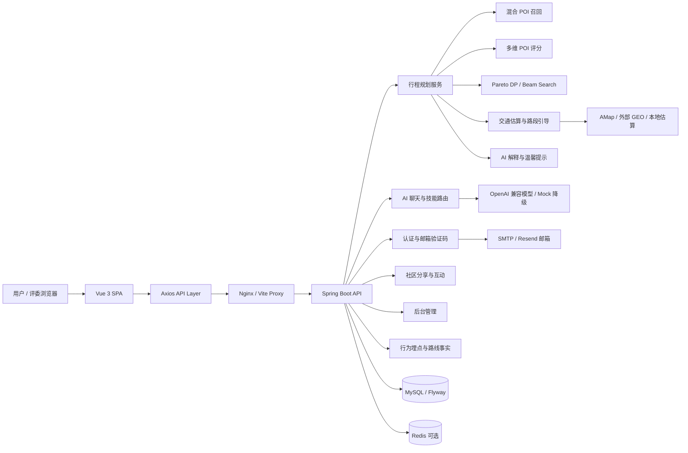
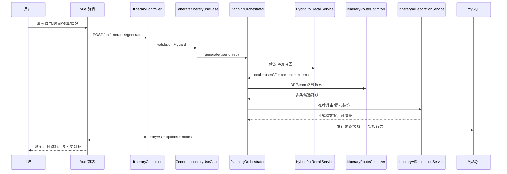
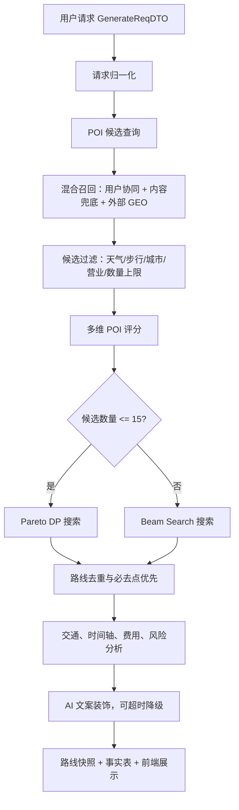

# 行城有数（CityTrip）

> 面向城市短途文旅、Citywalk 与周末微旅行场景的 **个性化智能行程规划 + 社区路线分享系统**。项目坚持“**算法规划为主、LLM 解释与交互增强为辅**”：路线由后端可解释算法生成，大模型负责需求理解、说明生成和对话式调整。

## 目录

- [1. 项目定位](#1-项目定位)
- [2. 痛点分析与需求响应](#2-痛点分析与需求响应)
- [3. 项目创新](#3-项目创新)
- [4. 技术创新](#4-技术创新)
- [5. 系统架构](#5-系统架构)
- [6. 功能模块](#6-功能模块)
- [7. 核心业务流程](#7-核心业务流程)
- [8. 算法设计](#8-算法设计)
- [9. 算法薄弱点与增强建议](#9-算法薄弱点与增强建议)
- [10. 技术栈](#10-技术栈)
- [11. 本地运行](#11-本地运行)
- [12. Docker 一体化部署](#12-docker-一体化部署)
- [13. REST API 概览](#13-rest-api-概览)
- [14. 项目结构](#14-项目结构)
- [15. 工程质量与安全](#15-工程质量与安全)
- [16. 后续路线图](#16-后续路线图)

---

## 1. 项目定位

“行城有数”不是一个简单的 AI 旅游文案生成器，而是一个将 **POI 数据、用户偏好、时间窗、交通耗时、预算、天气、同行人群、步行强度、历史行为和社区反馈** 统一纳入路线规划的完整 Web 系统。

项目当前重点面向：

- 成都等城市短途游、一日游、半日游、Citywalk 场景；
- 朋友、亲子、情侣、独自出行等不同同行关系；
- 雨天、夜游、少走路、低预算、必去景点等约束型需求；
- 比赛/答辩场景下需要可演示、可部署、可解释的完整产品链路。

核心设计原则：

| 原则 | 体现 |
| --- | --- |
| 算法主导 | POI 选择、路线顺序和时间安排由评分、召回、交通矩阵、DP/Beam Search 等模块完成。 |
| AI 增强 | LLM 主要承担智能补全、自然语言解释、事实问答、路线修改建议，而不是直接决定路线。 |
| 可解释 | 输出每个节点的推荐理由、交通耗时、费用、营业状态、风险提示和多方案对比。 |
| 可闭环 | 用户从生成、收藏、发布、评论、点赞到行为埋点，形成后续推荐优化的数据基础。 |
| 可降级 | 外部模型、地图、Redis、SMTP 不可用时，可回落到 Mock、本地估算或内容召回。 |

---

## 2. 痛点分析与需求响应

| 痛点 | 具体表现 | 本项目解决方式 |
| --- | --- | --- |
| 攻略碎片化 | 用户在地图、点评、社交平台、攻略之间反复切换。 | 统一采集城市、时间、预算、偏好等条件，自动生成结构化行程。 |
| LLM 路线不可执行 | 大模型容易忽略营业时间、交通耗时或编造景点。 | 用真实 POI、时间窗、交通估算和预算规则约束路线，LLM 只做解释增强。 |
| 个性化不足 | 不同预算、天气、同行人群得到的路线差异不明显。 | 多维评分覆盖主题、预算、雨天、夜游、步行、同行人、必去点和历史偏好。 |
| 首站不合理 | 从当前位置出发时，首站可能太远或换乘成本过高。 | 引入 departure 坐标解析和首段 distance/time/mode 惩罚。 |
| 调整成本高 | 不满意某个景点时往往需要重新规划整条路线。 | 支持换一版、单点替换、手动编辑、版本恢复和结果页对话式生成草案。 |
| 好路线难复用 | 用户满意路线无法沉淀给其他人参考。 | 支持社区发布、标签、封面、评论、点赞、置顶和社区语义检索。 |
| 部署链路长 | 前端、后端、数据库、缓存、Nginx 部署复杂。 | 提供 Docker all-in-one 镜像，适合比赛快速部署和演示。 |

---

## 3. 项目创新

1. **从工具到产品闭环**
   项目形成了“需求采集 → 智能补全 → 多方案规划 → 地图/时间轴展示 → 局部调整 → 保存收藏 → 社区发布 → 互动反馈 → 行为画像 → 再推荐”的闭环，而不是一次性问答。

2. **路线算法与大模型职责分离**
   后端算法决定路线是否可执行，大模型负责自然语言理解、解释和交互，降低幻觉风险。

3. **面向真实用户调整场景**
   支持单点替换、手动编辑、版本恢复和结果页聊天触发重新生成，不把“生成结果”当成终点。

4. **社区与推荐数据闭环**
   路线发布、评论、点赞、收藏和行为埋点可沉淀为后续推荐系统训练与评估数据。

5. **比赛答辩友好**
   项目具备首页叙事、结果页可视化、社区大厅、后台管理、Docker 部署、API 文档和测试基础，便于展示系统完整性。

---

## 4. 技术创新

| 方向 | 设计 | 相关代码 |
| --- | --- | --- |
| 混合 POI 召回 | 本地精选 POI + 外部实时 POI + 用户协同过滤 + 内容兜底。 | `backend/src/main/java/com/citytrip/service/impl/HybridPoiRecallService.java` |
| 多目标路线搜索 | 小候选集走 Pareto DP，大候选集走 Beam Search，兼顾质量与性能。 | `backend/src/main/java/com/citytrip/service/impl/ItineraryRouteOptimizer.java` |
| 可配置算法权重 | 权重从硬编码拆出，支持默认值和运行期更新。 | `AlgorithmWeightsProperties`、`DynamicAlgorithmWeightProvider` |
| 首段交通惩罚 | 对出发点到首站的时间、距离、交通方式、换乘成本建模。 | `ItineraryRouteOptimizer#buildStartAccessProfiles` |
| 路线事实分析 | 输出交通、时间轴、费用、营业风险、路段引导和地图 path points。 | `RouteAnalysisService`、`SegmentRouteGuideService` |
| AI 技能路由 | 聊天前置 POI 查询、附近酒店、路线上下文、行程编辑、重新生成等技能。 | `backend/src/main/java/com/citytrip/service/skill/SkillRouterService.java` |
| 事实与行为表 | 保存路线生成事实、节点事实和用户行为，支撑后续推荐评估。 | `route_plan_fact`、`route_node_fact`、`user_behavior_event` |
| 工程降级 | 模型、地图、缓存、邮件服务均可配置启停或降级。 | `RoutingLlmServiceImpl`、`GeoEnhancedTravelTimeServiceImpl`、`AiRequestGuard` |

---

## 5. 系统架构



后端采用分层结构：

```text
Controller 层：AuthController / ItineraryController / ChatController / AdminController
Application 层：GenerateItineraryUseCase / ReplanItineraryUseCase / SmartFillUseCase
Domain 层：planning / scoring / routing / ai / policy
Infrastructure 层：mapper / geo / llm gateway / redis / mail / flyway
Persistence 层：MyBatis-Plus Mapper + MySQL
```

---

## 6. 功能模块

| 模块 | 功能说明 | 前端页面/组件 | 后端入口 |
| --- | --- | --- | --- |
| 首页与需求采集 | 城市、时间、预算、偏好、AI 智能补全 | `/`、`Home.vue`、`HomeAiPanel.vue` | `SmartFillUseCase` |
| 认证中心 | 邮箱验证码注册、登录、退出、重置密码 | `/auth` | `AuthController`、`UserServiceImpl` |
| 行程规划 | 多约束路线生成、多方案返回、路线事实保存 | `/result` | `ItineraryController`、`PlanningOrchestrator` |
| 结果展示 | 地图、时间轴、路段引导、统计卡、方案对比 | `Result.vue`、`ItineraryMapCard.vue` | `RouteAnalysisService` |
| AI 对话 | SSE 流式问答、事实证据、路线编辑技能 | `ChatWidget.vue` | `ChatController`、`SkillRouterService` |
| 历史收藏 | 保存行程、收藏、命名、继续调整 | `/history` | `SavedItineraryCommandService` |
| 社区大厅 | 路线帖子、筛选、详情、点赞、评论 | `/community`、`/community/:id` | `CommunityInteractionService` |
| 后台管理 | 用户管理、POI 管理、社区治理 | `/admin/*` | `AdminController` |
| 数据分析 | 用户行为事件、路线事实、节点事实 | 无直接页面 | `analytics/*`、MySQL fact tables |
| 部署运维 | all-in-one 镜像、Nginx、MySQL、Redis | Docker | `Dockerfile`、`docker-compose.yml` |

---

## 7. 核心业务流程



关键链路：

- 注册/登录：`POST /api/users/send-code`、`POST /api/users`、`POST /api/sessions`。
- 生成路线：`POST /api/itineraries/generate`。
- 智能补全：`POST /api/itineraries/smart-fill`。
- 换一版：`PATCH /api/itineraries/{id}/replan`。
- 替换单点：`PATCH /api/itineraries/{id}/nodes/{poiId}/replacement`。
- 手动编辑：`POST /api/itineraries/{id}/edits/apply`。
- 发布社区：`PATCH /api/itineraries/{id}/public`。
- 流式聊天：`POST /api/chat/messages/stream`。

---

## 8. 算法设计

当前算法版本：`hybrid-dp-beam-v2`；召回策略标识：`hybrid-usercf-content-v1`。

### 8.1 总流程



### 8.2 POI 评分

系统把 POI 价值拆成多个可解释分量：

```text
POI_SCORE = priority
          + theme_match
          + companion_fit
          + must_visit_bonus
          + night_bonus
          + weather_fit
          + walking_fit
          + budget_fit
          + external_realtime_bonus
          - stale_status_penalty
          - long_stay_penalty
          - missing_business_hours_penalty
          - crowd_penalty
```

关键特征：`priorityScore`、`tags/themes`、`suitableFor/companionType`、`avgCost/budgetLevel`、`indoor/rainFriendly/isRainy`、`walkingLevel`、`nightAvailable/isNight`、`crowdPenalty/statusStale`、`sourceType/externalDataCompleteness`。

### 8.3 路线效用

```text
ROUTE_UTILITY = Σ(POI_SCORE * route_score_weight)
              - Σ(travel_time * travel_penalty_weight)
              - Σ(wait_time * wait_penalty_weight)
              - Σ(crowd_risk * crowd_penalty_weight)
              - first_leg_access_penalty
```

主要约束：营业时间、用户日程时间窗、停留时长、路段交通时间、最大站点数、必去点覆盖、出发位置到首站的距离/时间/交通方式。

### 8.4 混合召回

`HybridPoiRecallService` 当前逻辑：

1. 从数据库拉取规划候选 POI；
2. 按城市、雨天、步行强度等做过滤；
3. 有用户历史时构建用户 POI 偏好向量；
4. 查询相似用户，结合余弦相似度和重叠支持度；
5. 融合内容分、协同分、画像分、邻居支持分和重复访问惩罚；
6. Redis 可选缓存召回结果；
7. 冷启动或查询失败时降级为内容召回。

---

## 9. 算法薄弱点与增强建议

从软件工程老师和算法评审角度看，当前算法已经不是简单规则排序，但还没有达到“可证明优、可训练、可评测”的成熟推荐系统水平。建议按优先级分层改进。

### 9.1 立即修正（1-3 天）

1. **修正用户画像标签 Top-K 逻辑**
   `HybridPoiRecallService#scoreByProfile` 中标签亲和度排序后 `limit(2)`，应确认取的是最高亲和度标签。建议改为降序 Top-K，并补充单元测试。

2. **必去点从高权重升级为硬约束**
   当前 `mustVisitScore=120` 更像强偏好，不等价于严格约束。建议搜索前锁定必去候选；若无法满足，返回“哪些必去点无法安排及原因”。

3. **预算纳入路线状态**
   当前预算主要参与 POI 评分，建议将总预算作为 DP/Beam 的资源维度，超过预算直接剪枝或降权。

4. **输出评分解释**
   后端已有 `ScoreBreakdown`，建议把主要评分分量返回前端，用于解释“为什么推荐这个点”。

5. **补算法回归场景**
   固定构造雨天、夜游、低预算、必去点、远首站、多人同行等测试集，防止后续改动造成路线质量退化。

### 9.2 中期增强（1-3 周）

| 方向 | 建议 |
| --- | --- |
| Learning-to-Rank | 用 `route_plan_fact`、`route_node_fact`、`user_behavior_event` 训练排序模型，校准经验权重。 |
| 多样性约束 | 对候选路线加入类别/区域/主题多样性，避免多方案只是顺序变化。 |
| 资源约束搜索 | 将问题建模为带时间窗的 Orienteering Problem / Resource Constrained Shortest Path。 |
| 局部搜索修复 | Beam 结果后接 2-opt、插入、替换、跨日迁移等局部搜索，提高路线质量。 |
| Embedding 召回 | 对 POI 描述、社区帖子、用户自然语言需求做向量召回，再用 rerank 精排。 |
| 实时特征 | 引入实时拥挤度、天气、节假日、交通状态和临时闭园信息。 |

### 9.3 长期升级（1-2 个月）

- 上下文多臂老虎机或强化学习：根据点击、收藏、替换、发布行为动态学习权重。
- 多目标 Pareto 前沿展示：让用户显式选择“省钱/少走路/高质量/小众探索”。
- 可解释推荐报告：展示约束满足度、风险点、替代点和评分贡献。
- 城市迁移能力：抽象城市画像、商圈图谱和主题标签体系。
- 自动评测平台：指标包括约束违例率、平均交通占比、NDCG、覆盖率、新颖性、多样性、用户满意度等。

---

## 10. 技术栈

### 前端

- Vue 3、Vue Router 4、Element Plus、Axios、Vite
- Leaflet / AMap JS API 可选配置
- Vitest / Node test
- html2canvas、lottie-web、Lenis 等视觉增强依赖

### 后端

- Java 17、Spring Boot 3.4.x、MyBatis-Plus
- MySQL 8.x、Flyway、Redis 可选
- Spring Mail / Resend SMTP
- Spring AI / OpenAI 兼容模型接口
- JWT、BCrypt、Jakarta Validation

### 部署

- Docker / Docker Compose
- Nginx
- all-in-one 容器：前端静态资源、Spring Boot Jar、MySQL、Redis、Nginx 同容器启动

---

## 11. 本地运行

### 11.1 环境要求

- Node.js 18+
- npm 9+
- JDK 17
- Maven 3.9+
- MySQL 8.x
- Redis 可选

### 11.2 数据库初始化

推荐使用 Flyway 自动迁移：

```text
backend/src/main/resources/db/migration/
```

也可参考手动 SQL：

```sql
source backend/sql/init.sql;
source backend/sql/full_upgrade_safe.sql;
```

Docker 初始化 SQL：

```text
deploy/onebox/mysql-init/001-citytrip-bootstrap.sql
```

### 11.3 后端配置与启动

不要提交真实 `.env`、`application.yml`、数据库密码、JWT Secret 或 API Key。示例配置：

```text
backend/src/main/resources/application.example.yml
.env.example
deploy/onebox/env.production.example
```

复制配置：

```powershell
Copy-Item backend/src/main/resources/application.example.yml backend/src/main/resources/application.yml
```

本地启动：

```powershell
cd backend
mvn spring-boot:run
```

打包运行：

```powershell
cd backend
mvn -q -DskipTests package
java -jar target/citytrip-backend-0.0.1-SNAPSHOT.jar
```

### 11.4 前端配置与启动

```powershell
cd frontend
npm install
npm run dev
```

默认开发地址：

- 前端：`http://127.0.0.1:3000`
- 后端：`http://127.0.0.1:8082` 或配置中的 `SERVER_PORT`
- API：前端通过 `/api` 访问后端

---

## 12. Docker 一体化部署

准备环境变量：

```powershell
Copy-Item deploy/onebox/env.production.example .env
```

填写 `.env` 后构建和启动：

```powershell
docker compose build
docker compose up -d
```

查看日志：

```powershell
docker logs -f citytrip-allinone
```

健康检查：

```powershell
curl http://127.0.0.1/api/pois
```

关键变量包括：`MYSQL_ROOT_PASSWORD`、`APP_DB_PASSWORD`、`REDIS_PASSWORD`、`APP_JWT_SECRET`、`RESEND_API_KEY`、`OPENAI_API_KEY`、`OPENAI_BASE_URL`、`OPENAI_MODEL`、`APP_AMAP_API_KEY`、`VITE_AMAP_JS_API_KEY`。

---

## 13. REST API 概览

### 13.1 认证与用户

| 方法 | 路径 | 说明 |
| --- | --- | --- |
| `POST` | `/api/users/send-code` | 发送注册邮箱验证码 |
| `POST` | `/api/users` | 注册并返回登录会话 |
| `POST` | `/api/sessions` | 登录 |
| `DELETE` | `/api/sessions/current` | 退出登录 |
| `GET` | `/api/users/me` | 获取当前用户 |
| `POST` | `/api/auth/password/send-code` | 发送重置密码验证码 |
| `POST` | `/api/auth/password/reset` | 使用验证码重置密码 |

### 13.2 行程规划

| 方法 | 路径 | 说明 |
| --- | --- | --- |
| `POST` | `/api/itineraries` | 兼容路径：生成路线，返回 `201` |
| `POST` | `/api/itineraries/generate` | 登录态生成路线 |
| `POST` | `/api/itineraries/smart-fill` | 自然语言智能补全需求 |
| `GET` | `/api/itineraries` | 获取历史/收藏路线列表 |
| `GET` | `/api/itineraries/{id}` | 获取路线详情 |
| `PATCH` | `/api/itineraries/{id}/replan` | 换一版路线 |
| `PATCH` | `/api/itineraries/{id}/nodes/{poiId}/replacement` | 替换某个景点 |
| `POST` | `/api/itineraries/{id}/selection` | 选择候选方案 |
| `PUT` | `/api/itineraries/{id}/favorite` | 收藏路线 |
| `DELETE` | `/api/itineraries/{id}/favorite` | 取消收藏 |
| `POST` | `/api/itineraries/{id}/segments/{segmentIndex}/travel` | 计算某段交通信息 |
| `POST` | `/api/itineraries/{id}/edits/apply` | 应用编辑操作 |
| `POST` | `/api/itineraries/{id}/edits/restore` | 恢复历史版本 |
| `GET` | `/api/itineraries/{id}/edit-versions` | 查看编辑版本列表 |

### 13.3 社区、POI、聊天与后台

| 方法 | 路径 | 说明 |
| --- | --- | --- |
| `PATCH` | `/api/itineraries/{id}/public` | 发布/撤回社区展示 |
| `GET` | `/api/itineraries/community` | 社区路线帖子列表 |
| `GET` | `/api/itineraries/community/{id}` | 社区路线帖子详情 |
| `GET` | `/api/itineraries/community/{id}/comments` | 评论列表 |
| `POST` | `/api/itineraries/community/{id}/comments` | 发布评论 |
| `POST` | `/api/itineraries/community/{id}/like` | 点赞 |
| `DELETE` | `/api/itineraries/community/{id}/like` | 取消点赞 |
| `GET` | `/api/pois` | POI 列表 |
| `GET` | `/api/pois/{id}` | POI 详情 |
| `GET` | `/api/pois/search` | POI 搜索 |
| `POST` | `/api/chat/messages/stream` | SSE 流式聊天 |
| `GET` | `/api/admin/users` | 管理员用户列表 |
| `GET` | `/api/admin/pois` | 管理员 POI 列表 |
| `GET` | `/api/admin/community/posts` | 管理员社区帖子列表 |

更完整字段约定见：`docs/api-contract/citytrip-api-contract.md`。

---

## 14. 项目结构

```text
.
├── backend/
│   ├── pom.xml
│   ├── sql/
│   └── src/main/
│       ├── java/com/citytrip/
│       │   ├── controller/              # REST API
│       │   ├── service/application/     # 应用用例与业务流程
│       │   ├── service/domain/          # planning / scoring / routing / ai
│       │   ├── service/impl/            # LLM、GEO、规划编排等实现
│       │   ├── service/skill/           # 聊天技能路由
│       │   ├── mapper/                  # MyBatis 映射
│       │   ├── model/                   # DTO / VO / Entity
│       │   ├── analytics/               # 行为埋点和路线事实
│       │   └── config/                  # 安全、跨域、外部服务配置
│       └── resources/
│           ├── application.example.yml
│           ├── db/migration/
│           └── mapper/
├── frontend/
│   ├── package.json
│   ├── vite.config.js
│   └── src/
│       ├── api/
│       ├── components/
│       ├── router/
│       ├── store/
│       ├── utils/
│       └── views/
├── deploy/onebox/
├── docs/api-contract/
├── docs/superpowers/plans/
├── Dockerfile
├── docker-compose.yml
├── .env.example
└── README.md
```

---

## 15. 工程质量与安全

### 15.1 质量保障

- 后端：JUnit 5、Spring Boot Test、MockRestServiceServer、Mockito。
- 前端：Vitest、Vue Test Utils、Node test。
- 数据库：Flyway 迁移覆盖核心表结构。
- API：`docs/api-contract/citytrip-api-contract.md` 作为共享契约基础。
- 算法：包含 `ItineraryRouteOptimizerDpTest`、`HybridPoiRecallServiceTest`、`DefaultPoiScoringStrategyTest` 等回归测试。

常用验证命令：

```powershell
cd backend
mvn test
```

```powershell
cd frontend
npm test
npm run build
```

### 15.2 安全与配置

- 真实密钥只通过 `.env` 或服务器环境变量注入。
- `.env.example` 和 `application.example.yml` 只保留占位符。
- JWT Secret 要求使用足够长度随机字符串。
- 管理员自动创建默认关闭，避免弱密码账号被静默创建。
- AI 重型接口受 `AiRequestGuard` 并发与冷却保护。
- CORS 通过环境变量收敛，生产环境应只允许真实域名。

### 15.3 比赛打包清单

- [ ] 不包含真实 `.env`、`application.yml`、API Key、数据库密码、JWT Secret。
- [ ] 不包含 `node_modules`、`backend/target`、`frontend/dist`、`frontend/.vite`。
- [ ] 不包含 `.git`、`.idea`、`.vscode`、`.m2`、`.codex`、`.worktrees`。
- [ ] 包含 `README.md`、`Dockerfile`、`docker-compose.yml`、`backend/`、`frontend/`、`deploy/onebox/` 和必要 SQL。

---

## 16. 后续路线图

### 产品路线

- 多城市数据扩展：从成都样例扩展到更多城市。
- 社区个性化首页：基于用户偏好和社区互动推荐路线帖。
- 移动端/小程序：复用现有 API Contract，降低多端接入成本。
- 旅行中实时调整：根据定位、天气、营业状态变化动态重排。

### 技术路线

- OpenAPI / codegen：用统一契约生成前后端类型。
- 观测体系：接入 traceId、指标监控、慢查询分析和调用链日志。
- 缓存策略：对 POI 搜索、路线估算、社区列表和召回结果做分级缓存。

### 算法路线

- 短期：Top-K、预算硬约束、必去点硬约束、评分解释输出。
- 中期：Embedding 召回 + rerank、多样性约束、局部搜索修复。
- 长期：Learning-to-Rank、上下文 Bandit、跨城市迁移和自动化离线评测。

---

## 结语

“行城有数”的价值不在于简单套用大模型，而在于已经具备 **工程化、可解释、可部署、可持续迭代** 的智能文旅系统雏形。下一阶段如果补齐算法评测、数据质量和学习排序能力，项目可以从“可演示的智能路线系统”升级为“可验证、可优化、可规模化运营的城市文旅推荐平台”。
