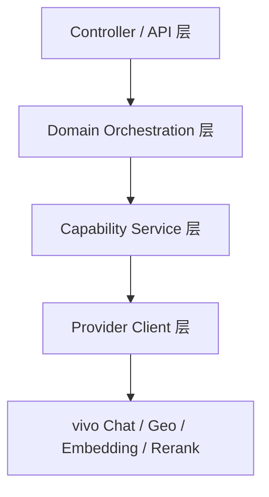
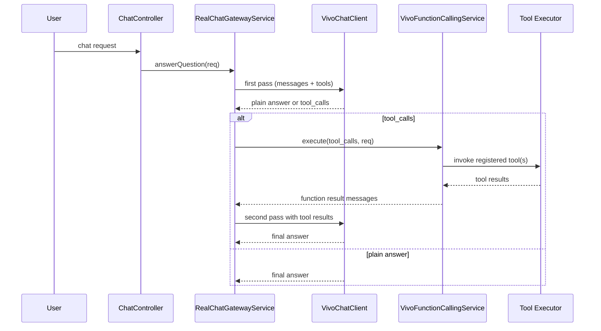

# vivo 第一优先级能力接入设计

**日期**：2026-04-26  
**目标**：在不破坏现有路线页与社区页视觉的前提下，把 vivo 的 4 个第一优先级能力——`chat`、`function calling`、`POI 搜索`、`embedding + rerank`——做成项目内可复用、可测试、可降级、可观测的稳定能力底座。

---

## 一、问题定义

当前项目已经接入了部分“真实模型/真实 GEO”能力，但整体仍然存在 5 个工程问题：

1. **provider 适配不完整**  
   现有 `OpenAiGatewayClient` 主要按通用 OpenAI 兼容层思路调用，没有把 vivo 1745 文档要求的 `requestId`、模型白名单、tool scene、provider 错误模型系统化纳入。

2. **能力散落在业务代码里**  
   路线文案、聊天问答、GEO 搜索、社区搜索都各自带一点 provider 逻辑，后续加 OCR、翻译、语音时会继续发散。

3. **function calling 还不是真工具链**  
   目前没有统一工具注册、工具调用解析、工具执行回灌、错误包装和轮次控制，无法把“模型会调用工具”升级成“业务真实可用”。

4. **POI 搜索与路线规划语义混淆过**  
   用户明确要求不再把 `/search/geo` 误写成真实导航能力，因此必须把 GEO 能力彻底收正为“POI 搜索/地理检索”。

5. **社区搜索仍以关键词过滤为主**  
   当前社区列表主要依赖 `keyword/theme/sort` 的本地过滤和排序，没有真正把语义召回和精排接入主链路。

---

## 二、范围与非范围

## 2.1 本次范围

### 后端能力
- vivo chat 正式接入
- vivo function calling 工具链
- vivo POI 搜索正式接入
- 社区语义搜索（embedding + rerank）
- 统一配置、日志、降级和 readiness 状态

### 前端接线
- 增加 POI 搜索 API 封装
- 让 chat status 能展示更细 readiness
- 保持现有页面结构，最小化接线

## 2.2 明确不在本次范围

- 不做真实 turn-by-turn 导航
- 不把 vivo `/search/geo` 当作路线规划引擎
- 不重做路线生成主算法
- 不重做地图视觉
- 不重做社区页面视觉
- 不接 OCR、翻译、TTS、ASR、图片生成、视频生成
- 不引入 embedding 持久化表作为前置条件

---

## 三、目标结果

本次交付完成后，项目应满足以下结果：

1. **所有真实模型调用统一走 vivo 正式配置**
2. **聊天链路支持 1~2 轮受控 function calling**
3. **`/api/pois/search` 可返回真实 vivo POI 结果，并具备本地回退**
4. **社区搜索在 `keyword` 非空时自动进入“语义粗排 + rerank 精排”**
5. **provider 不可用时，页面仍能可用，不出现大面积 500**
6. **状态接口能看出 chat/tool/geo/embedding/rerank 是否 ready**
7. **测试能覆盖主要请求契约、降级分支、排序分支和工具调用分支**

---

## 四、现有代码落点

## 4.1 需要修改的现有文件

### 配置与基础设施
- `F:\dachuang\backend\src\main\java\com\citytrip\config\LlmProperties.java`
- `F:\dachuang\backend\src\main\resources\application.yml`
- `F:\dachuang\.env`

### 模型调用
- `F:\dachuang\backend\src\main\java\com\citytrip\service\impl\OpenAiGatewayClient.java`
- `F:\dachuang\backend\src\main\java\com\citytrip\service\impl\RealLlmGatewayService.java`
- `F:\dachuang\backend\src\main\java\com\citytrip\service\impl\RealChatGatewayService.java`

### GEO / POI
- `F:\dachuang\backend\src\main\java\com\citytrip\service\geo\impl\GeoSearchServiceImpl.java`
- `F:\dachuang\backend\src\main\java\com\citytrip\controller\PoiController.java`

### 社区搜索
- `F:\dachuang\backend\src\main\java\com\citytrip\service\application\community\CommunityItineraryQueryService.java`

### 状态输出
- `F:\dachuang\backend\src\main\java\com\citytrip\model\vo\ChatStatusVO.java`

### 前端最小接线
- `F:\dachuang\frontend\src\api\poi.js`
- `F:\dachuang\frontend\src\api\chat.js`
- `F:\dachuang\frontend\src\api\itinerary.js`

## 4.2 新增文件

### vivo provider 客户端
- `F:\dachuang\backend\src\main\java\com\citytrip\service\impl\vivo\VivoRequestIdFactory.java`
- `F:\dachuang\backend\src\main\java\com\citytrip\service\impl\vivo\VivoChatClient.java`
- `F:\dachuang\backend\src\main\java\com\citytrip\service\impl\vivo\VivoEmbeddingClient.java`
- `F:\dachuang\backend\src\main\java\com\citytrip\service\impl\vivo\VivoRerankClient.java`

### function calling 基础设施
- `F:\dachuang\backend\src\main\java\com\citytrip\service\impl\vivo\VivoToolDefinition.java`
- `F:\dachuang\backend\src\main\java\com\citytrip\service\impl\vivo\VivoToolRegistry.java`
- `F:\dachuang\backend\src\main\java\com\citytrip\service\impl\vivo\VivoFunctionCallingService.java`

### 语义搜索
- `F:\dachuang\backend\src\main\java\com\citytrip\service\application\community\CommunitySemanticSearchService.java`

### 统一返回对象
- `F:\dachuang\backend\src\main\java\com\citytrip\model\vo\PoiSearchResultVO.java`

### 测试
- `F:\dachuang\backend\src\test\java\com\citytrip\service\impl\VivoFunctionCallingServiceTest.java`
- `F:\dachuang\backend\src\test\java\com\citytrip\service\application\community\CommunitySemanticSearchServiceTest.java`

---

## 五、总体架构

本次采用 **能力中台化接入**，而不是在现有业务类里继续散点打补丁。

### 5.1 分层



### 5.2 各层职责

#### Provider Client 层
只负责发请求、加鉴权、加 `requestId`、解析 provider 响应和标准化错误。

#### Capability Service 层
对项目暴露“可用能力”，屏蔽 vivo 文档细节，例如：
- 聊天回答
- 工具执行循环
- POI 搜索
- 语义排序

#### Domain Orchestration 层
把能力接入到现有业务场景：
- 路线文案
- Chat Widget
- 社区搜索
- POI 搜索接口

#### Controller / API 层
继续给前端提供稳定接口，不把 provider 差异泄露到前端。

---

## 六、配置设计

## 6.1 LLM scene 扩展

当前 `LlmProperties` 已有：
- `chat`
- `text`

本次新增：
- `tool`

### Scene 含义
- `chat`：聊天、短回答、实时性优先
- `text`：路线文案、社区帖子草稿、结构化文本生成
- `tool`：function calling，准确性优先

## 6.2 建议环境变量

```env
OPENAI_BASE_URL=https://api-ai.vivo.com.cn/v1
OPENAI_API_KEY=***

OPENAI_CHAT_MODEL=Doubao-Seed-2.0-mini
OPENAI_TEXT_MODEL=Doubao-Seed-2.0-pro
OPENAI_TOOL_MODEL=Volc-DeepSeek-V3.2

OPENAI_CHAT_REASONING_EFFORT=minimal
OPENAI_TEXT_REASONING_EFFORT=medium
OPENAI_TOOL_REASONING_EFFORT=medium

APP_GEO_ENABLED=true
APP_GEO_BASE_URL=https://api-ai.vivo.com.cn/search/geo
APP_GEO_ROUTE_PATH=

APP_SEMANTIC_ENABLED=true
APP_RERANK_ENABLED=true
APP_SEMANTIC_CACHE_TTL_SECONDS=86400
APP_SEMANTIC_CANDIDATE_LIMIT=30
```

## 6.3 模型白名单

在 `LlmProperties` 中对 vivo 允许模型做白名单校验，仅允许：
- `Volc-DeepSeek-V3.2`
- `Doubao-Seed-2.0-mini`
- `Doubao-Seed-2.0-lite`
- `Doubao-Seed-2.0-pro`
- `qwen3.5-plus`

如果配置成其他模型：
- 不直接阻止启动
- 但在状态接口中给出 warning
- 实际调用时明确报 provider/model mismatch

---

## 七、vivo chat 设计

## 7.1 核心原则

1. 保留 `OpenAiGatewayClient` 作为对外门面，减少调用方改动
2. 内部拆出 `VivoChatClient` 处理 vivo 细节
3. 每次调用都自动带 query 参数 `requestId`
4. 统一支持：
   - 非流式回答
   - SSE 流式回答
   - tool 调用
   - `reasoning_effort`

## 7.2 对现有类的改造方式

### `OpenAiGatewayClient`
保留公共职责：
- `request(...)`
- `stream(...)`

新增内部职责：
- 检测当前 baseUrl 是否为 vivo
- 若是 vivo，则把请求转给 `VivoChatClient`
- provider 返回 `200` 但 body 含错误时仍视为失败

### `RealLlmGatewayService`
继续承担路线文案与装饰功能，但不再关心 provider 细节，只选择 scene：
- `generateRouteWarmTip(...)` -> `text`
- `decorateRouteExperience(...)` -> `text`

### `RealChatGatewayService`
继续承担聊天链路，但当检测到工具可用且问题类型匹配时，允许进入 function calling。

## 7.3 请求契约

### 输入
- `model`
- `messages`
- `stream`
- `max_tokens`
- `reasoning_effort`
- query 参数 `requestId`

### 输出（项目内部）
- `content`
- `finishReason`
- `toolCalls`
- `providerRequestId`
- `rawProviderModel`

## 7.4 失败与重试

### 允许 1 次重试
- connect timeout
- read timeout
- provider `502/503`

### 不重试
- 鉴权错误
- 模型参数错误
- tool schema 错误
- provider 明确返回 bad request

### 降级
- 若 `llm.fallbackToMock=true`，可切 mock
- 若不允许 fallback，则明确失败，不伪装成功

---

## 八、function calling 设计

## 8.1 第一落点

function calling 第一阶段只落在：
- `POST /api/chat/messages`
- `POST /api/chat/messages/stream`

即：
- 首页 AI
- 结果页 AI
- Chat Widget

**不直接切入路线生成主算法**，避免影响现有 planner 主链路稳定性。

## 8.2 工具注册

首批仅接 3 个真实工具：

### `search_poi`
用途：
- 让模型检索实时 POI

输入：
- `keyword`
- `city`
- `limit`

### `get_route_context`
用途：
- 基于当前结果页上下文读取路线事实

输入：
- `itineraryId`
- `selectedOptionKey`

### `search_community_posts`
用途：
- 按 query 检索语义相关的社区帖子

输入：
- `query`
- `theme`
- `limit`

## 8.3 工具循环

时序如下：



## 8.4 循环约束

- 最多 2 轮模型调用
- 最多 3 次工具调用
- 未注册工具直接拒绝
- 工具异常不抛前端 500，而是包装成工具失败结果再回灌模型
- 工具无结果必须显式返回 `NO_RESULT`

## 8.5 工具失败包装

统一包装格式：

```json
{
  "tool": "search_poi",
  "status": "error",
  "message": "tool temporarily unavailable"
}
```

这样模型最终回答时基于事实说“当前无法检索实时 POI”，而不是瞎编。

---

## 九、POI 搜索设计

## 9.1 provider 真实能力边界

vivo `1736` 仅用于：
- POI 搜索
- 地理检索

明确不是：
- 真实导航
- turn-by-turn 路线规划

## 9.2 `GeoSearchServiceImpl` 改造方向

当前该类兼容了多个旧路径语义，本次要收正：

### 正式查询参数
- `keywords`
- `city`
- `page_num`
- `page_size`
- `requestId`

### header
- `Authorization: Bearer AppKey`

### 城市兼容策略
统一兼容：
- 中文城市名，例如 `成都`
- 行政编码，例如 `510100`

## 9.3 对外接口

在 `PoiController` 新增：

### `GET /api/pois/search`

参数：
- `keyword`：必填
- `city`：选填
- `limit`：选填，默认 8，最大 15

返回：
`List<PoiSearchResultVO>`

### `PoiSearchResultVO`
字段：
- `name`
- `address`
- `category`
- `latitude`
- `longitude`
- `cityName`
- `adcode`
- `source`

## 9.4 降级策略

优先级：
1. vivo 实时结果
2. 本地 POI 模糊匹配
3. 空数组

**不抛 500 给前端**，除非请求参数非法。

---

## 十、embedding + rerank 设计

## 10.1 目标

把社区搜索从“关键词过滤”升级成：

**候选召回 -> embedding 粗排 -> rerank 精排**

## 10.2 首版不做持久化 embedding 表

原因：
- 避免本次引入新的 SQL 迁移风险
- 先把能力接通和排序链路跑通

### 当前方案
- embedding 进程内缓存
- cache key = 文本哈希 + `updatedAt`
- TTL = 24h

## 10.3 文本拼接规则

社区帖子参与语义排序的文本统一拼成：

```text
title + shareNote + routeSummary + themes + cityName + nodeNames
```

其中 `nodeNames` 由路线节点名按顺序拼接。

## 10.4 排序流程

### 阶段一：embedding 粗排
- query 用 `m3e-base` 生成向量
- 候选帖子文本用 `m3e-base` 生成向量
- 计算 cosine similarity
- 取前 30

### 阶段二：rerank 精排
- 用 `bge-reranker-large`
- 输入 query + 前 30 文本
- 得到 rerank 分数

### 最终分数

```text
finalScore = rerankScore * 0.75 + cosineScoreNormalized * 0.25
```

## 10.5 接入位置

在：
`F:\dachuang\backend\src\main\java\com\citytrip\service\application\community\CommunityItineraryQueryService.java`

中做如下规则：

- `keyword` 为空 -> 保持原逻辑
- `keyword` 非空 -> 启用 semantic pipeline
- `theme` 先过滤，再做 semantic 排序
- `pinnedRecords` 的展示逻辑保持不变

## 10.6 降级

### rerank 不可用
- 回退 embedding 排序

### embedding 也不可用
- 回退原 keyword/filter/sort 逻辑

保证社区页任何时候都不因为语义服务故障而返回空白或 500。

---

## 十一、状态接口设计

## 11.1 现状

`ChatStatusVO` 当前只有基础配置状态，不足以判断：
- tool 是否 ready
- geo 是否 ready
- embedding/rerank 是否 ready

## 11.2 扩展字段

新增：
- `toolReady`
- `geoReady`
- `embeddingReady`
- `rerankReady`
- `warnings`

### 目标返回示例

```json
{
  "provider": "real",
  "configured": true,
  "realModelAvailable": true,
  "fallbackToMock": false,
  "timeoutSeconds": 20,
  "model": "Doubao-Seed-2.0-mini",
  "baseUrl": "https://api-ai.vivo.com.cn/v1",
  "toolReady": true,
  "geoReady": true,
  "embeddingReady": true,
  "rerankReady": true,
  "warnings": [],
  "message": "vivo chat/tool/geo/semantic ready"
}
```

---

## 十二、日志与观测设计

## 12.1 统一打点字段

所有 vivo 相关日志统一带：
- `providerRequestId`
- `scene`
- `model`
- `endpoint`
- `durationMs`
- `success`

## 12.2 tool chain 日志

额外记录：
- `toolName`
- `toolCallCount`
- `toolStatus`
- `toolResultSize`

## 12.3 semantic search 日志

额外记录：
- `keyword`
- `candidateCount`
- `embeddingUsed`
- `rerankUsed`
- `fallbackReason`

---

## 十三、前端影响

## 13.1 只做最小接线

### `frontend/src/api/poi.js`
新增：
- `reqSearchPoi(keyword, city, limit)`

### `frontend/src/api/chat.js`
读取更完整的 readiness 字段

### `frontend/src/api/itinerary.js`
保持社区列表接口调用方式不变，不强制修改页面查询结构

## 13.2 明确不做

- 不重写 `Community.vue`
- 不重写 `Result.vue`
- 不新增复杂 UI 流程

前端只消费增强后的后端能力。

---

## 十四、测试设计

## 14.1 单元测试

### chat / tool
- `OpenAiGatewayClientTest`
  - 自动附带 `requestId`
  - provider `200 + error body` 能识别失败
  - 普通回答解析正确
  - tool call 解析正确

- `VivoFunctionCallingServiceTest`
  - 工具白名单校验
  - 最多 2 轮限制
  - 工具失败包装
  - 工具结果回灌后二次生成

### POI
- `GeoSearchServiceImplTest`
  - 参数格式符合 1736
  - 城市名 / adcode 兼容
  - 无结果返回空数组
  - 本地回退正常

### semantic
- `CommunitySemanticSearchServiceTest`
  - embedding 粗排
  - rerank 精排
  - `finalScore` 组合排序
  - rerank 挂掉回退 embedding
  - embedding 挂掉回退原排序

- `CommunityItineraryQueryServiceTest`
  - `keyword` 非空自动启用 semantic
  - `theme` 先过滤再排序
  - pinned 帖子逻辑不受影响

## 14.2 集成验证

至少验证 4 条：

1. 路线温馨提示/路线装饰走 vivo `text` scene
2. chat 问“太古里附近晚上还能去哪”时触发 `search_poi`
3. `GET /api/pois/search` 在有结果/无结果时都返回稳定格式
4. 社区搜索“适合情侣夜游散步”时语义相关帖子能提升排序

## 14.3 回归命令

后端：
- `mvn -q -Dtest=OpenAiGatewayClientTest,VivoFunctionCallingServiceTest,GeoSearchServiceImplTest,CommunitySemanticSearchServiceTest,CommunityItineraryQueryServiceTest test`

前端：
- `npm run build`
- `npm run test -- --runInBand`（若当前 vitest 配置已可运行）

---

## 十五、实施顺序

### Phase 1：chat 网关正规化
- scene 配置
- provider requestId
- 错误模型
- readiness 输出

### Phase 2：function calling
- tool registry
- tool executor
- tool loop
- chat 接入

### Phase 3：POI 搜索正式化
- GEO 参数收正
- `/api/pois/search`
- 本地回退

### Phase 4：社区语义搜索
- embedding client
- rerank client
- semantic search service
- community query service 接入

### Phase 5：联调回归
- 单元测试
- 集成测试
- 前端构建验证

---

## 十六、风险与控制

## 16.1 工作区已有大量未提交改动

控制策略：
- 本次只在上文列出的文件范围内改动
- 不顺手清理或重构无关文件
- 不动社区页面视觉结构

## 16.2 provider 文档与兼容层差异

控制策略：
- 先补测试再改生产逻辑
- `OpenAiGatewayClient` 继续做门面，避免大面积接口改动

## 16.3 semantic 能力不稳定

控制策略：
- rerank 可回退 embedding
- embedding 可回退原排序
- 不让社区主列表依赖单点 provider 成功

---

## 十七、验收标准

满足以下条件才算本次设计实现完成：

1. vivo chat 在项目中有统一 scene 配置且真实可调用
2. chat 至少有一条工具链真实跑通
3. `/api/pois/search` 能返回正式结果并具备回退
4. 社区 keyword 搜索已进入 semantic pipeline
5. 状态接口能展示 chat/tool/geo/embedding/rerank readiness
6. 测试覆盖核心能力和回退分支
7. 前端现有路线页/社区页视觉不被回退

---

## 十八、后续扩展位

本次完成后，可平滑扩展：
- OCR 接入
- 翻译接入
- TTS/ASR 接入
- embedding 持久化
- 相似路线推荐
- 相似帖子推荐
- 发帖去重提醒

这些能力都建立在本次 provider client / capability service / domain orchestration 的分层之上，不需要再次大拆架构。
