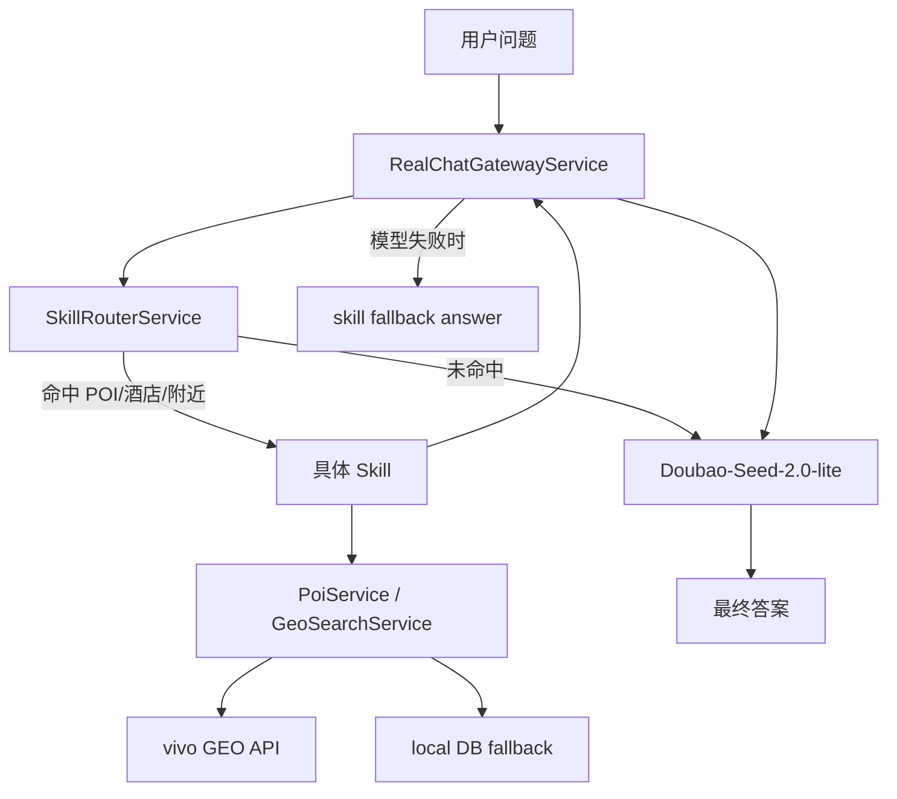

# 本地 Skill Router + GEO/POI 能力层设计

**日期：** 2026-04-28  
**范围：** `F:\dachuang\backend`、配置项 `OPENAI_*` / `APP_GEO_*`、聊天入口与 POI/GEO 查询链路  
**目标：** 将“附近酒店 / POI / 周边推荐”能力沉淀到本地后端，让任意聊天模型都能复用同一套 GEO/POI 能力；聊天模型固定使用 `Doubao-Seed-2.0-lite` 做总结与润色；查询优先实时走 vivo GEO，失败时保留本地数据库兜底。

---

## 1. 背景与问题

当前项目已经具备两类不同能力，但边界容易混淆：

1. **GEO/POI 查询能力**  
   由 `APP_GEO_BASE_URL=https://api-ai.vivo.com.cn/search/geo` 提供，使用 `APP_GEO_API_KEY` 鉴权。它本质上是 vivo 提供的地理搜索 API，不是大模型推理接口。

2. **聊天模型能力**  
   由 `OPENAI_BASE_URL` / `OPENAI_CHAT_MODEL` / `OPENAI_TOOL_MODEL` 等配置驱动，走 `/v1/chat/completions` 链路，负责对话、总结、工具编排等。

现状问题在于：

- 用户会把“模型会推荐附近酒店”误解为“模型自带 GEO 能力”。
- 真实查询能力其实在后端与 GEO API，而不是在模型内部。
- 某个模型无权限、超时或返回空内容时，聊天能力会拖垮本来已经可用的 POI/酒店能力。
- 当前代码虽然已有 `search_poi`、`GeoSearchServiceImpl`、`PoiServiceImpl`、`maybePrefetchToolPayload(...)` 等雏形，但还缺少一层清晰、稳定、可测试的本地技能路由层。

本轮设计目标不是“让模型自己学会查地图”，而是：

> **把实时 POI/酒店能力收口到本地后端，由模型通过这层能力消费结果。**

---

## 2. 设计原则

1. **能力归后端，文案归模型**  
   POI/GEO 查询、参数组装、兜底与排序在后端；模型只负责理解和总结。

2. **实时 GEO 优先**  
   主数据源优先走 vivo GEO，避免维护全量本地酒店/POI 库。

3. **本地库保留兜底**  
   GEO 超时、报错、无结果时，保留本地数据库兜底能力。

4. **模型可替换**  
   任何聊天模型都应能复用同一套技能层；本轮默认聊天模型使用 `Doubao-Seed-2.0-lite`。

5. **功能不绑死 function calling**  
   即便某个模型不支持或不稳定支持工具调用，本地能力层仍可主动命中意图并返回结果。

6. **降级优先可用性**  
   模型失败时，至少仍然要把结构化 POI/酒店结果返回给前端，不允许出现“查询能力已通但页面空白”。

---

## 3. 已确认的用户决策

本次设计以以下已确认决策为准：

- **主查询源：** 优先实时查 vivo GEO。
- **兜底策略：** 保留本地数据库 fallback。
- **聊天模型：** `OPENAI_CHAT_MODEL=Doubao-Seed-2.0-lite`。
- **能力边界：** 不把酒店/POI 全量存入数据库；后端掌握的是能力层，而非全量静态数据源。
- **目标方向：** 在本地后端写技能层，让任意模型都可借这层完成 POI/酒店工具能力。

---

## 4. 方案选型

### 4.1 备选方案

#### 方案 A：继续把 POI/酒店能力绑在模型工具调用上
- 优点：表面实现快。
- 缺点：强依赖模型权限、模型工具调用格式、模型稳定性；模型一挂能力就断。

#### 方案 B：本地 Skill Router + GEO/POI 能力层 + 模型总结（**选中**）
- 优点：能力稳定、模型可替换、降级清晰、测试边界明确。
- 缺点：需要补一层本地技能路由与统一结果结构。

#### 方案 C：全量自建酒店/POI 库 + 模型只读本地库
- 优点：完全可控。
- 缺点：维护成本高，当前阶段没有必要。

### 4.2 结论

本轮选择 **方案 B**：

> **本地 Skill Router + 实时 vivo GEO 主查 + 本地数据库兜底 + `Doubao-Seed-2.0-lite` 总结输出。**

---

## 5. 目标架构

### 5.1 角色划分

#### A. 聊天总入口
保留：
- `F:\dachuang\backend\src\main\java\com\citytrip\service\impl\RealChatGatewayService.java`

职责：
- 接收聊天请求与上下文。
- 调用本地技能路由层。
- 在拿到结构化 skill 结果后，调用聊天模型做总结。
- 处理模型失败时的降级返回。

#### B. 本地技能路由层（新增）
建议新增：
- `F:\dachuang\backend\src\main\java\com\citytrip\service\skill\SkillRouterService.java`

职责：
- 判断当前用户问题是否命中工具型意图。
- 分发到具体 skill。
- 统一结果格式，避免上层了解每个 skill 内部细节。

#### C. 具体 skill（新增）
建议新增：
- `PoiSearchSkill`
- `NearbyHotelSkill`
- `NearbyPoiSkill`
- `RouteContextSkill`

职责：
- 只负责一件事：查询并输出结构化业务结果。
- 不直接负责“聊天语气润色”。

#### D. 现有 GEO/POI 能力层（复用）
复用：
- `F:\dachuang\backend\src\main\java\com\citytrip\service\geo\impl\GeoSearchServiceImpl.java`
- `F:\dachuang\backend\src\main\java\com\citytrip\service\impl\PoiServiceImpl.java`

职责：
- 真实发起 vivo GEO 查询。
- 将 GEO 结果标准化。
- 在 GEO 无结果时回退本地数据库。

#### E. 聊天模型
配置：
- `OPENAI_CHAT_MODEL=Doubao-Seed-2.0-lite`

职责：
- 基于 skill 返回结果做人类可读的总结、推荐理由和后续追问建议。
- 不直接承担实时 GEO 查询。

### 5.2 关系示意

---

## 6. 请求数据流

### 6.1 命中 skill 的正常流

以“推荐宽窄巷子附近酒店”为例：

1. 前端将请求发到聊天接口。
2. `RealChatGatewayService` 收到 `ChatReqDTO` 和上下文。
3. `SkillRouterService` 判断这是“附近酒店”意图。
4. `NearbyHotelSkill` 从问题与上下文中提取：
   - 关键词 / 目的地
   - 城市
   - 位置或半径（若可得）
5. skill 调用 `GeoSearchServiceImpl` / `PoiServiceImpl`：
   - 优先实时查 vivo GEO
   - 无结果时 fallback 本地库
6. skill 返回统一结构化结果。
7. `RealChatGatewayService` 将该结果作为受控上下文交给 `Doubao-Seed-2.0-lite`。
8. 模型输出自然语言总结，后端将“总结 + 结构化结果”一起返回前端。

### 6.2 未命中 skill 的普通聊天流

例如用户问“成都三天两夜怎么安排”：

1. 请求进入 `RealChatGatewayService`。
2. `SkillRouterService` 判断不属于 POI/GEO 工具型问题。
3. 直接走普通聊天模型流程。

### 6.3 结果共享方式

双模型或模型与技能层共享的不是内部权重，而是**同一份业务上下文**：

- 用户问题与会话历史
- 城市、偏好、行程上下文
- GEO 返回的 POI / nearby / route 数据
- skill 产出的结构化 JSON 结果

---

## 7. 统一结果结构

建议新增一个统一的 skill 返回对象，例如：

- `skillName`
- `status`
- `intent`
- `query`
- `city`
- `results`
- `source`
- `evidence`
- `fallbackMessage`

### 7.1 字段意图

- `skillName`：哪个 skill 处理了本次请求。
- `status`：`ok` / `fallback` / `empty` / `error`。
- `intent`：例如 `nearby_hotel`、`poi_search`、`nearby_poi`。
- `query`：结构化查询条件。
- `city`：本次查询的城市。
- `results`：结构化结果列表。
- `source`：`vivo-geo` / `local-db` / `hybrid`。
- `evidence`：支撑回答的简短证据或来源说明。
- `fallbackMessage`：模型不可用时可直接返回给前端的兜底说明。

### 7.2 为什么要统一结构

统一结构后：

- 上层聊天入口无需知道每个 skill 的内部逻辑。
- 前端在模型失败时仍能直接消费结构化结果。
- 后续新增其它 skill（如美食、社区、路线）时可以复用同一套通道。

---

## 8. GEO 与数据库策略

### 8.1 主查询源

优先走：
- `APP_GEO_BASE_URL=https://api-ai.vivo.com.cn/search/geo`
- `APP_GEO_API_KEY` Bearer 鉴权

这条链路属于：
- 外部地理搜索 API
- 非大模型接口
- 非 `OPENAI_*` 聊天模型链路

### 8.2 fallback 策略

保留当前 `PoiServiceImpl.searchLive(...)` 的思想：

1. 先查 `GeoSearchService.searchByKeyword(...)`
2. 结果为空时回退 `baseMapper.searchByNameInCity(...)`

本设计不要求维护全量酒店库，数据库只承担：
- 兜底
- 精选数据
- 可选缓存（如未来需要）

---

## 9. 降级与错误处理

### 9.1 GEO 超时或报错
- 记录日志。
- 自动回退本地数据库。
- 若本地有结果，则照常继续流程。

### 9.2 GEO 无结果
- 回退本地数据库。
- 本地也无结果时，skill 返回 `empty` 状态和明确的 `fallbackMessage`。

### 9.3 模型超时、401、空回答或异常
- 不影响 skill 结果。
- `RealChatGatewayService` 直接返回 skill 结构化结果与 `fallbackMessage`。
- 前端仍然能看到可用的 POI/酒店列表。

### 9.4 普通聊天不命中 skill
- 直接走普通聊天流程，不强行调用 GEO。

### 9.5 调试可见性

建议保留来源标记，便于排查：
- `vivo-geo`
- `local-db`
- `hybrid`
- `model-summary`
- `fallback-without-model`

---

## 10. 配置与模型策略

### 10.1 本轮确定配置

- `OPENAI_CHAT_MODEL=Doubao-Seed-2.0-lite`
- `APP_GEO_ENABLED=true`
- `APP_GEO_BASE_URL=https://api-ai.vivo.com.cn/search/geo`
- `APP_GEO_API_KEY` 已配置且可用

### 10.2 对 `OPENAI_TOOL_MODEL` 的态度

本设计不要求当前阶段强依赖 `OPENAI_TOOL_MODEL` 才能完成 POI/酒店工具能力。原因：

- 本地 skill 路由可以主动识别并执行 GEO/POI 查询。
- 这样不会因为某个 tool model 无权限（例如 `BlueLM-7B-Chat` 当前 401）而让整条能力链路失效。

未来若后续确有稳定 tool model，也可以把它接入统一结果结构，但不是本轮前提。

---

## 11. 测试方案

### 11.1 Skill 路由测试
验证：
- “宽窄巷子附近酒店” 命中 `NearbyHotelSkill`
- “春熙路附近景点” 命中 `NearbyPoiSkill`
- “成都三天两夜怎么安排” 不命中 GEO 类 skill，走普通聊天

### 11.2 Skill 执行测试
验证：
- GEO 有结果时优先返回 `vivo-geo`
- GEO 报错或空结果时回退 `local-db`
- skill 返回结构字段完整

### 11.3 聊天集成测试
验证：
- `RealChatGatewayService` 能正确接入 skill 结果
- 模型可用时输出“总结 + 结构化结果”
- 未命中 skill 时仍保持普通聊天能力

### 11.4 降级测试
验证：
- 模型超时 / 空响应 / 401 时仍返回 skill 结果
- 前端不会拿到空白 answer

### 11.5 回归测试
重点关注：
- `F:\dachuang\backend\src\main\java\com\citytrip\service\impl\PoiServiceImpl.java`
- `F:\dachuang\backend\src\main\java\com\citytrip\service\geo\impl\GeoSearchServiceImpl.java`
- `F:\dachuang\backend\src\main\java\com\citytrip\controller\PoiController.java`
- 现有 `/api/pois/search` 链路不被破坏

---

## 12. 非目标

本轮不做：

- 不构建全量本地酒店/POI 库。
- 不要求接通某个特定 tool model 才能启用 skill 层。
- 不把所有聊天问题都强行纳入 GEO 工具流。
- 不在这一轮解决所有社区、路线、行程功能的统一技能化，只先聚焦 POI/酒店/GEO 类问题。

---

## 13. 推荐实施顺序

1. 先补本地 skill 抽象与统一返回结构。
2. 再实现 `SkillRouterService` 与首批 GEO/POI 类 skill。
3. 将 `RealChatGatewayService` 改造成“先 skill、后模型总结、最后降级”的流程。
4. 固定聊天模型为 `Doubao-Seed-2.0-lite`。
5. 补足单元测试与降级测试。
6. 用真实 `/api/pois/search` 与聊天入口做端到端回归验证。

---

## 14. 预期结果

实现后，项目将具备以下性质：

- **POI/酒店能力掌握在本地后端**：查询逻辑、路由、降级由后端控制。
- **实时 GEO 为主**：不依赖维护庞大的本地酒店库。
- **模型只负责总结**：`Doubao-Seed-2.0-lite` 输出更自然，但不承担查 GEO 的职责。
- **模型可替换**：未来换模型时，不需要重写 POI/酒店能力层。
- **模型失败功能不死**：至少仍能给前端返回结构化查询结果。

