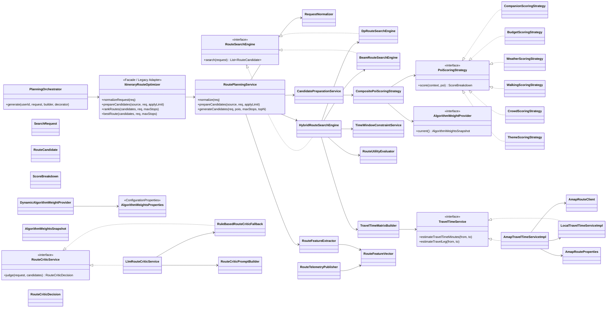

# 路线算法层与 AI 交互层重构设计

日期：2026-05-01
状态：已获口头设计确认，待实施计划拆解
范围：后端路线规划算法层、交通耗时服务、路线特征埋点、LLM Generator-Critic 交互层

## 1. 背景与目标

当前 `ItineraryRouteOptimizer` 同时承担请求归一化、候选 POI 过滤、业务打分、DP/Beam Search、起点解析、时间窗判断等职责，形成 God Class。与此同时，算法权重以静态常量硬编码在类中，难以调参和做线上实验；交通耗时主要依赖本地估算或通用 GEO 封装，没有面向高德路径规划 API 的明确实现；LLM 主要作为后置文本润色，未参与候选路线的常识判别与取舍。

本设计目标是把路线规划改造成：

1. 可拆分、可测试、可替换的算法架构；
2. 可配置、可热更新的权重系统；
3. 基于高德真实路网、但有本地降级保护的 TravelTimeService；
4. 支持 Learning To Rank 过渡的数据埋点与特征向量；
5. 传统算法 Generator + LLM Critic 的深度融合路线决策模式。

所有代码修改必须落到项目持久化代码中，不使用仅在局部临时变量中模拟效果的表面实现。

## 2. 现状约束

已确认的现有文件和调用关系：

- `backend/src/main/java/com/citytrip/service/impl/ItineraryRouteOptimizer.java`：约 998 行，当前 God Class。
- `backend/src/main/java/com/citytrip/service/TravelTimeService.java`：已有交通耗时接口。
- `backend/src/main/java/com/citytrip/service/impl/LocalTravelTimeServiceImpl.java`：本地距离估算实现。
- `backend/src/main/java/com/citytrip/service/impl/GeoEnhancedTravelTimeServiceImpl.java`：当前 GEO 增强耗时实现。
- `backend/src/main/java/com/citytrip/service/impl/PlanningOrchestrator.java`：生成主流程依赖 `ItineraryRouteOptimizer`。
- `backend/src/main/java/com/citytrip/assembler/ItineraryComparisonAssembler.java`：当前只展示 1 条路线 option。
- `backend/src/main/java/com/citytrip/analytics/RoutePlanFactPublisher.java` 与 `RoutePlanFactPersistenceService.java`：已有基础埋点链路。
- `backend/src/main/java/com/citytrip/service/impl/RealLlmGatewayService.java`、`RoutingLlmServiceImpl.java`、`SafePromptBuilder.java`：已有 LLM 调用与 Prompt 构建基础。

## 3. 总体方案

采用渐进式绞杀者重构：短期保留 `ItineraryRouteOptimizer` 作为 Facade / Legacy Adapter，对外 API 不立即破坏；内部逐步委托到新的算法服务、搜索引擎、打分策略和交通服务。待所有调用点稳定后，再将 `ItineraryRouteOptimizer` 标记为废弃或删除。

推荐分层：

- `service.domain.routing`：路线搜索引擎、候选路线模型、搜索请求、路线效用评估。
- `service.domain.scoring`：POI 打分策略、分数明细、权重读取。
- `service.domain.planning`：候选准备、请求归一化、路线特征提取、Generator 编排。
- `service.domain.traffic` 或 `service.impl`：高德交通耗时实现、客户端、fallback。
- `service.domain.ai`：Route Critic 服务、Prompt 构建、LLM 决策解析与规则 fallback。
- `analytics`：候选路线、特征向量、Critic 决策的结构化埋点与持久化。

## 4. 目标类图



## 5. 阶段 1：工程解耦与 God Class 拆分

新增 `RouteSearchEngine` 接口封装路线搜索算法。实现类包括：

- `DpRouteSearchEngine`：负责小候选集的精确 DP / Pareto 搜索。
- `BeamRouteSearchEngine`：负责大候选集的 Beam Search。
- `HybridRouteSearchEngine`：根据候选规模自动选择 DP 或 Beam。

新增 `PoiScoringStrategy` 接口封装 POI 打分。实现类包括：

- `ThemeScoringStrategy`
- `CompanionScoringStrategy`
- `BudgetScoringStrategy`
- `WeatherScoringStrategy`
- `WalkingScoringStrategy`
- `CrowdScoringStrategy`

`CompositePoiScoringStrategy` 聚合所有策略，返回 `ScoreBreakdown`，不再只返回一个 opaque double。

`ItineraryRouteOptimizer` 第一阶段保留为 facade，避免一次性改动所有调用点。内部委托给 `RoutePlanningService`、`CandidatePreparationService`、`HybridRouteSearchEngine`。

## 6. 阶段 2：魔法数字配置化与热更新

新增：

- `AlgorithmWeightsProperties`：`@ConfigurationProperties(prefix = "app.algorithm.weights")`
- `AlgorithmWeightsSnapshot`：不可变权重快照。
- `AlgorithmWeightProvider`：运行时权重读取接口。
- `DynamicAlgorithmWeightProvider`：基于 `AtomicReference` 保存当前权重。

配置项示例：

```yaml
app:
  algorithm:
    weights:
      score-weight: 6.0
      wait-penalty-weight: 0.5
      travel-penalty-weight: 1.0
      crowd-penalty-weight: 4.0
      candidate-crowd-score-weight: 1.5
      companion-match-score: 2.5
      group-travel-fit-score: 3.0
      group-travel-mismatch-penalty: 1.5
      rain-friendly-score: 1.5
      walking-fit-score: 1.0
      first-leg-time-penalty-weight: 0.9
      first-leg-distance-penalty-weight: 4.8
      first-leg-transfer-penalty-weight: 7.0
```

热更新策略：打分组件和路线效用组件每次计算时读取 `weightProvider.current()`，不长期缓存权重。后续可接管理接口、数据库、Redis、Nacos 或 Spring Cloud Refresh；第一版至少提供可编程更新点，避免权重被硬编码死在类中。

## 7. 阶段 3：高德真实路网与 fallback

新增：

- `AmapRouteProperties`
- `AmapRouteClient`
- `AmapTravelTimeServiceImpl implements TravelTimeService`
- `AmapRouteResponseParser`
- 可选：`TravelTimeCache`、`TravelModeSelector`

配置示例：

```yaml
app:
  amap:
    route:
      enabled: true
      api-key: ${AMAP_API_KEY:}
      security-key: ${AMAP_SECURITY_KEY:}
      base-url: https://restapi.amap.com
      connect-timeout-ms: 800
      read-timeout-ms: 1200
      cache-ttl-seconds: 86400
      preferred-modes:
        - transit
        - walking
        - driving
```

高德 API key、安全密钥和可视化地图 style 不写入代码仓库，使用环境变量或本地配置注入。代码中只保留配置项和读取逻辑。

fallback 规则：

1. 高德未启用、缺少 key、坐标无效：直接走 `LocalTravelTimeServiceImpl`。
2. 高德超时、限流、返回空路线、JSON 解析失败：记录结构化日志，fallback 到本地估算。
3. fallback 不向上抛异常，不阻断行程规划。
4. `TravelLegEstimate` 中标记 transport mode、distance、path points；后续可加入 fallback 标记用于埋点。

## 8. 阶段 4：数据驱动与 LTR 埋点

扩展路线返回结构，优先在 `ItineraryOptionVO` 级别追加：

- `featureVector`
- `scoreBreakdown`
- `generatorRank`
- `criticRank`
- `criticDecisionReason`
- `eliminatedBecause`

`RouteFeatureVector` 包含：

- `totalCost`
- `totalTravelTime`
- `totalWalkingDistance`
- `totalWaitTime`
- `stopCount`
- `themeMatchCount`
- `companionMatchCount`
- `businessRiskScore`
- `uniqueDistrictCount`
- `avgPoiScore`
- `scoreComponents`
- `amapFallbackCount`
- `transportModeDistribution`

结构化日志事件：

- `route_candidates_generated`
- `route_critic_decided`
- `route_option_displayed`
- `route_user_selected`
- `route_user_saved`
- `route_user_replanned`

持久化方案：扩展现有 `RoutePlanFactPublisher` 与 `RoutePlanFactPersistenceService`，新增候选路线级事实表或 JSON 字段，保存全部候选、展示状态、最终选择、特征向量和 Critic 决策。

## 9. 阶段 5：Generator-Critic AI 融合

Generator：传统后端算法基于高德耗时、权重配置、硬约束时间窗生成 Top 3 或 Top 5 条绝对可行候选路线。

Critic：新增 `RouteCriticService`：

```java
public interface RouteCriticService {
    RouteCriticDecision judge(GenerateReqDTO request, List<RouteCandidate> candidates);
}
```

实现：

- `LlmRouteCriticService`
- `RuleBasedRouteCriticFallback`
- `RouteCriticPromptBuilder`

Prompt 约束：

1. LLM 只能从后端候选路线中选择一条。
2. LLM 不能新增、删除、重排 POI。
3. LLM 根据用户自然语言需求做常识判别，如少走路、亲子、预算、雨天、不要太赶、拍照友好等。
4. 输出严格 JSON，包含 `selectedSignature`、`rankings`、`reason`、`eliminationReasons`、`riskWarnings`。
5. 如果 LLM 超时、返回非法 JSON、选择不存在 signature，则 fallback 到规则排序第一名，并记录 `criticFallback=true`。

## 10. 实施顺序

1. 建立基线测试，覆盖当前路线排序、时间窗、必去点、fallback 行为。
2. 新增接口和领域模型，不改变现有业务行为。
3. 抽出 POI 打分策略，保留旧结果兼容。
4. 抽出 DP / Beam 搜索引擎，`ItineraryRouteOptimizer` 改为委托。
5. 权重配置化，打分和路线效用改为读取 `AlgorithmWeightProvider`。
6. 接入 `AmapTravelTimeServiceImpl`，保留本地 fallback。
7. 扩展 Top N 路线、特征向量与结构化埋点。
8. 接入 LLM Critic，加入严格 JSON 解析与规则 fallback。
9. 清理旧类，逐步让上层调用 `RoutePlanningService`。

## 11. 测试策略

- 单元测试：各打分策略、权重读取、时间窗判断、DP/Beam 搜索边界。
- 集成测试：`PlanningOrchestrator` 生成完整 itinerary，验证 Top N、selected option、fallback。
- 高德 API 测试：使用 mock server 或 MockRestServiceServer 验证 walking/transit/driving 解析与异常降级。
- LLM Critic 测试：mock LLM 返回合法 JSON、非法 JSON、未知 signature、超时。
- 回归测试：现有生成、重规划、替换 POI 用例不破坏。

## 12. 非目标

本轮不直接实现 Learning To Rank 模型训练；只完成特征采集、候选样本记录和正负样本落表基础。本轮也不把高德 API key、安全密钥、地图 style 硬编码进仓库。

## 13. 风险与应对

- 风险：一次性迁移导致规划链路不可用。应对：保留 `ItineraryRouteOptimizer` facade，逐步委托。
- 风险：高德 API 抖动影响规划。应对：本地 fallback、超时控制、缓存。
- 风险：LLM 输出不稳定。应对：严格 JSON schema 解析、signature 白名单、规则 fallback。
- 风险：权重热更新和配置读取混乱。应对：统一通过 `AlgorithmWeightProvider` 获取当前快照。
- 风险：埋点字段过多污染 VO。应对：先集中在 option 级 feature/score 字段，节点级只保留必要信息。
